# Quorum

> A room of AI specialists that convene on Telegram, debate your problem out loud in distinct voices, and won't ship a fix until you sound sure.


Quorum is a multi-agent engineering orchestrator that lives inside a Telegram group. When something breaks — or when you just need a fast decision — a cast of specialist agents joins the room, speaks over voice notes, argues the problem to a verdict, and acts on your spoken approval. You are not reading a dashboard. **You are in the room.**

---

## Table of contents

- [1. The idea](#1-the-idea)
- [2. What makes it different](#2-what-makes-it-different)
- [3. The two anchor features](#3-the-two-anchor-features)
- [4. System architecture: three planes](#4-system-architecture-three-planes)
- [5. End-to-end incident lifecycle](#5-end-to-end-incident-lifecycle)
- [6. The cast](#6-the-cast)
- [7. The blackboard](#7-the-blackboard)
- [8. The conversation director](#8-the-conversation-director)
- [9. The debate engine](#9-the-debate-engine)
- [10. Emotion as a first-class signal](#10-emotion-as-a-first-class-signal)
- [11. The four-seam contract](#11-the-four-seam-contract)
- [12. The render pipeline](#12-the-render-pipeline)
- [13. Actuators](#13-actuators)
- [14. Extensibility: the specialist registry](#14-extensibility-the-specialist-registry)
- [15. Multi-agent patterns](#15-multi-agent-patterns)
- [16. Tech stack](#16-tech-stack)
- [17. Repo layout](#17-repo-layout)
- [18. Getting started](#18-getting-started)
- [19. The demo walk](#19-the-demo-walk)
- [20. Roadmap](#20-roadmap)
- [21. License](#21-license)

---

## 1. The idea

Most AI tools either narrate at you or silently execute. Quorum does neither. The agents talk *to each other* — out loud, in character, with distinct voices — and you can cut in at any point to redirect, override, or ask for more. **The debate is the interface.**

A typical run reads like overhearing a sharp on-call rotation:

- Something fails. The room opens on Telegram.
- **RootCause** reads the stack trace and posts a hypothesis.
- **Coder** drafts a fix. **Critic** cuts in — *"hold on, that retries against a gateway that's already down."*
- They go a round or two until confidence clears a bar.
- The **Orchestrator** turns to you and asks for approval — by voice.
- You answer. Quorum reads the **emotion** in your reply. If you don't sound sure, it holds.
- You confirm, steady this time. The fix ships. The store goes green. The room closes.

Every turn lands in the group as both a **text bubble** and a **voice note**. The group transcript *is* the incident log, scrolling live.

---

## 2. What makes it different

| Property | What it means in Quorum |
|---|---|
| **Agents argue, you overhear** | Coder and Critic hold opposing positions out loud. The Orchestrator only calls the vote when confidence clears a threshold. |
| **Dual-channel output** | Every agent turn is a text bubble *and* a voice note. Read the room or listen to it. |
| **Emotion-aware** | The room reads the emotion off your voice. It compresses when you sound stressed, and gates approval on whether you sound sure. |
| **Blackboard architecture** | One shared session object every agent reads and writes. Specialists never talk peer-to-peer; they leave state for each other on the board. |
| **Specialist registry** | Adding a new domain (Jira, CI, deploys, security) means registering a new specialist against a small interface. The router classifies and dispatches; it never does the work itself. |
| **Human in the loop, by voice** | Cut in at any point. Address an agent by name. Say "skip the analysis, just fix it." The director re-routes on your next message. |
| **Fail-closed gates** | Two gates protect irreversible actions: the Critic's confidence score *and* your emotional state. Both must clear before anything ships. |

---

## 3. The two anchor features

Everything else is supporting cast. Two features carry the experience.

### The audible debate

Coder proposes a fix. Critic challenges it. They revise and go again — and you hear the whole thing, one voice note at a time, in the Telegram group. Each agent has a distinct voice matched to its persona, and the Critic *sounds* uneasy when its confidence is low and eases off once it clears the bar, because delivery is driven by its own internal confidence score, not a script.

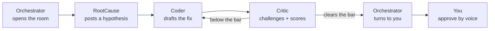

### Emotion-gated approval

Before anything irreversible ships, Quorum reads the emotion in your voice. Say *"yeah, ship it"* while sounding hesitant and it catches it — *"you don't sound sure about this. Want me to hold?"* It does not act until you sound like you mean it.

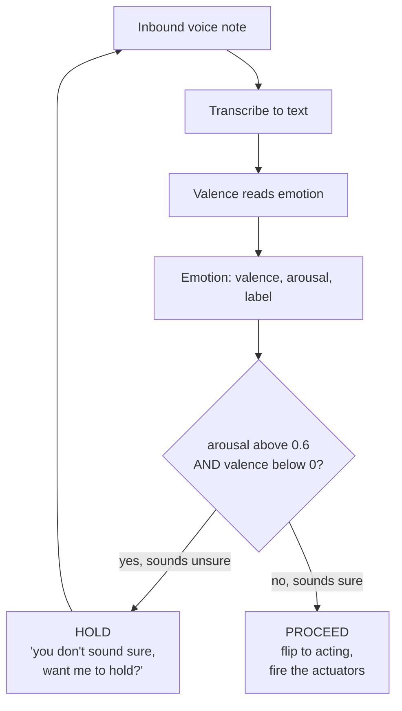

---

## 4. System architecture: three planes

The whole design rests on one rule: **n8n never decides who speaks, and the brain never touches a webhook or an API key.** The moment those blur, you are back in the God-Orchestrator anti-pattern.

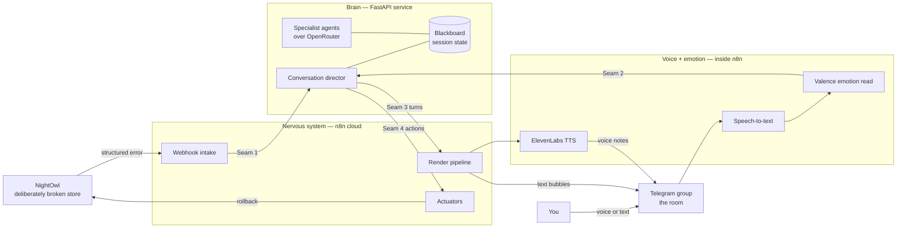

| Plane | Runs on | Owns |
|---|---|---|
| **Nervous system** | n8n cloud | Webhooks in, actuators out, renders every turn to Telegram. |
| **Brain** | FastAPI service | The blackboard, the specialist agents over OpenRouter, the conversation director. Pure logic, no keys beyond OpenRouter. |
| **Voice + emotion** | Inside n8n | ElevenLabs renders each turn to a voice note; Valence reads emotion off your inbound voice notes. |

**Why the split is deliberate:** every external integration sits on the n8n side, so the brain stays a pure decision engine that runs and tests in a terminal with no keys but OpenRouter. The two planes meet at exactly one URL and one frozen contract.

---

## 5. End-to-end incident lifecycle

The brain is stateful per session (an in-memory dict keyed by `session_id`). Each call returns **the batch of turns to play until the next point where it needs you, or it is done** — so n8n plays a batch, then waits for your reply only when the status is `awaiting_approval`.

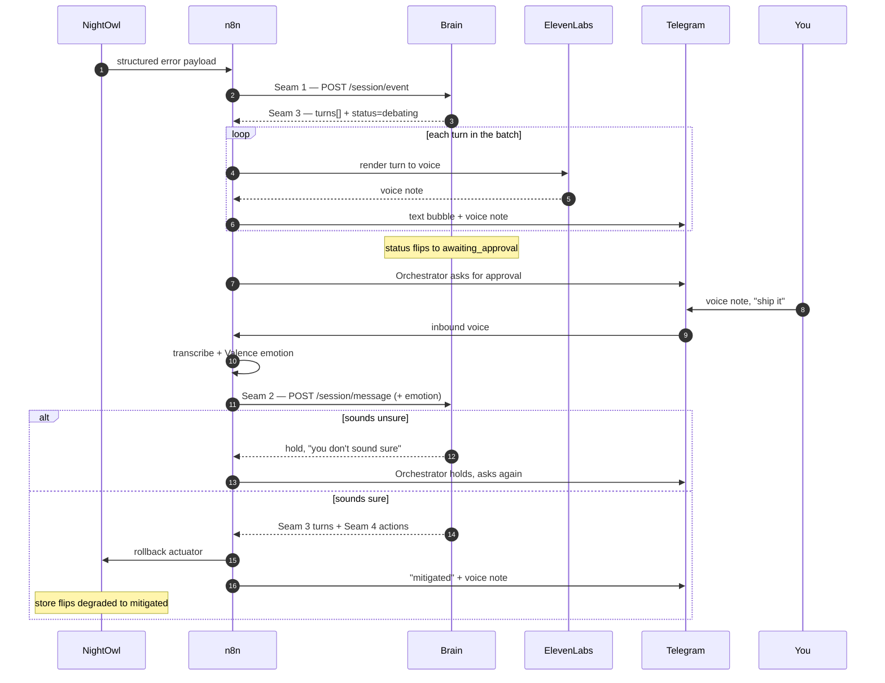

---

## 6. The cast

| Agent | Role | Persona | Model tier |
|---|---|---|---|
| **Orchestrator** | Runs the room, hands off by name, talks to you | Calm, in charge | mid |
| **RootCause** | Reads the stack trace, posts a hypothesis | Methodical, measured | smart |
| **Coder** | Drafts the fix, revises under critique | Confident, quick | smart |
| **Critic** | Challenges the fix, scores production-readiness | Dry, skeptical | smart (never a free model) |
| **PM** | Joins on command for one move, then dips | Smooth, brief | cheap |
| **Classifier / backchannel** | Reads the intent of your messages, acks | (no voice) | free |

Each agent has a distinct ElevenLabs voice matched to its persona. Model tiers follow the cost of the turn: **smart** models for the turns the demo's credibility hangs on (RootCause, Coder, Critic), **cheap/free** models for classification, acknowledgements, and the PM cameo. The Critic is never run on a free tier — structured output breaks and persona drifts, and the Critic is the one voice everything rests on.

> Model slugs drift. Quorum pins each agent to a **tier**, not a hard-coded string, and resolves real OpenRouter slugs at deploy time against the current model list.

---

## 7. The blackboard

Specialists never message each other directly. They read and write a single shared **Session** object — the blackboard. This keeps coordination auditable and lets the cast scale to any number of specialists without peer-to-peer wiring.

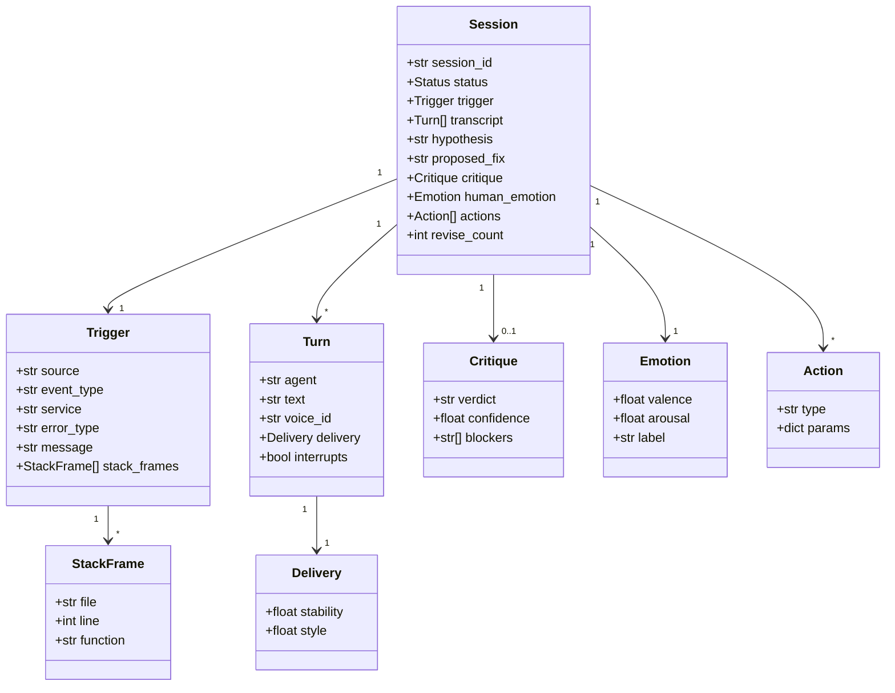

Two distinct emotion concepts live on the board and never get crossed:

- **`Emotion`** (`human_emotion`) is what *you* sound like — `valence`, `arousal`, `label`. It feeds the approval gate.
- **`Delivery`** is how an *agent* should sound — `stability`, `style`. It feeds ElevenLabs voice settings.

---

## 8. The conversation director

Who-speaks-next is a **policy keyed off `status`**, not a script. The director is the heart of the brain.

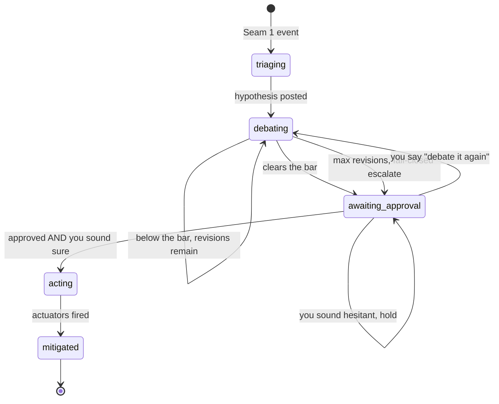

A human message reroutes everything. The director classifies your intent — **approve**, **debate again**, or **redirect** ("skip the analysis, just fix it") — and re-plans on the spot. Anything it can't classify is absorbed as context and the current state continues.

There are two flavors of interrupt, and they are different builds:

- **Agent-on-agent (authored).** When the Critic detects a blocker, its turn is flagged to interrupt. The director can inject it ahead of the Coder's tail — so you control where the drama lands.
- **Human (chat-native).** Because turns are sequential voice notes, *you interrupting* is just a new Telegram message arriving. The director reorders on the next message. No full-duplex audio engineering.

---

## 9. The debate engine

The Coder–Critic exchange is an **Actor-Critic loop** with a hard exit. The Coder proposes, the Critic scores, and the loop either clears the confidence bar, runs out of revisions and escalates fail-closed, or lands on approval.

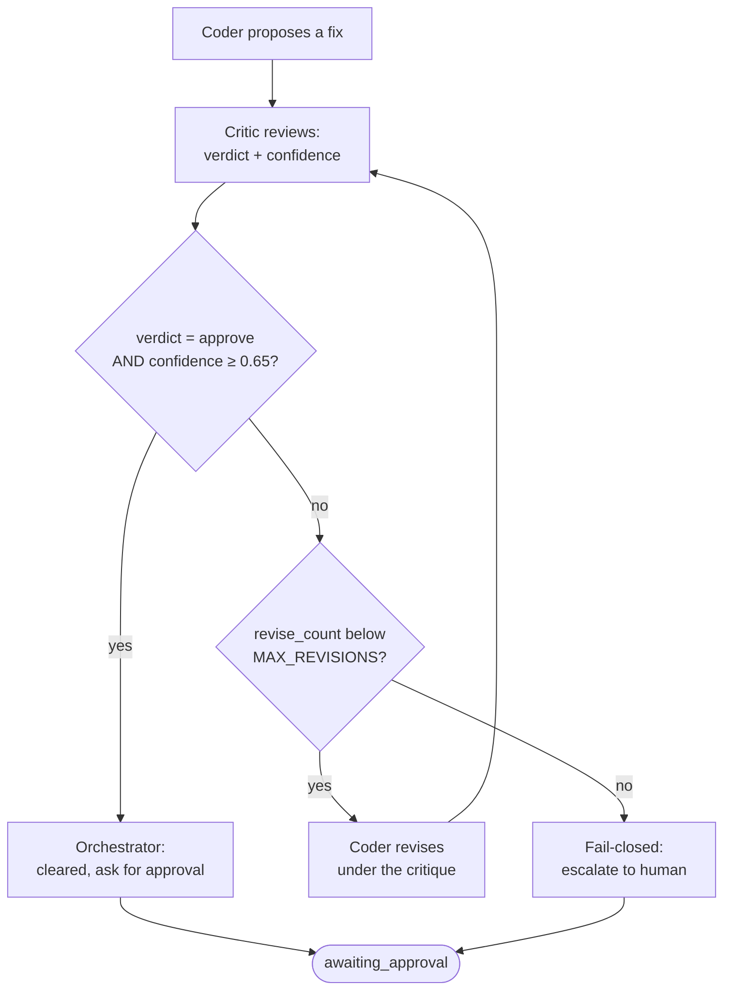

| Knob | Default | Meaning |
|---|---|---|
| `CONFIDENCE_BAR` | `0.65` | The Critic's confidence must reach this for the room to call the vote. |
| `MAX_REVISIONS` | `3` | After this many revise rounds without clearing the bar, the room escalates to you rather than shipping on a low score. |

The loop is bounded by construction: `revise_count` increments before each revision and a strict comparison guarantees termination. There is always an exit.

---

## 10. Emotion as a first-class signal

Emotion is not decoration bolted on at the end — it is data that drives behavior in two directions.

### Inbound: the approval gate

The gate is intentionally coarse, so it works even on a weak emotion signal:

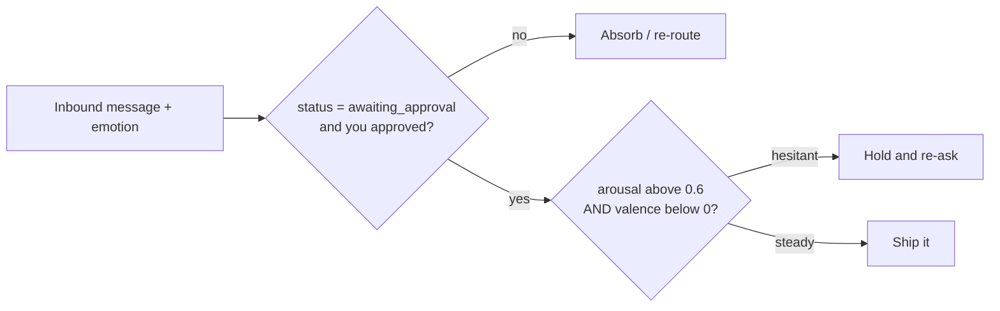

### Outbound: delivery derived from state

Each agent's voice delivery is computed from its own internal state, so the room *sounds* like the state of the problem.

| Situation | stability | style | Effect |
|---|---|---|---|
| Critic, low confidence | 0.30 | 0.65 | expressive, uneven — sounds worried |
| Critic, cleared the bar | 0.55 | 0.30 | steady — eased off |
| RootCause, methodical | 0.75 | 0.20 | flat, careful |
| Default / calm | 0.55 | 0.30 | neutral baseline |
| High arousal (you came in stressed) | 0.35 | 0.50 | tenser, slightly faster |

The room can also adapt *to you*: if your arousal is high, the Orchestrator is told to compress — shorter turns, straight to the fix, fewer options.

---

## 11. The four-seam contract

Everything decouples behind four seams. The brain is the source of truth; n8n only ever branches on `status`.

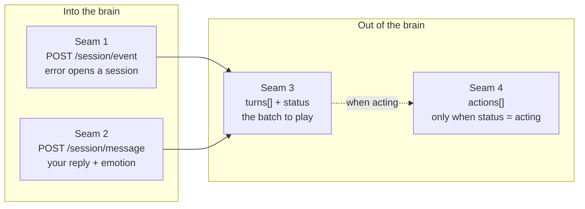

**Seam 1 — event in.** A new event (with `session_id: null`) opens a session; the brain returns the id.

```jsonc
// POST /session/event
{
  "session_id": null,
  "source": "nightowl",            // nightowl | github | jira | manual
  "event_type": "error",
  "payload": {
    "service": "checkout-service",
    "error_type": "CheckoutServiceTimeoutError",
    "message": "Payment gateway did not respond in time",
    "stack_frames": [
      { "file": "server/index.js", "line": 142, "function": "processPayment" }
    ]
  }
}
```

**Seam 2 — message in.** Your transcribed reply, carrying the emotion read off your voice.

```jsonc
// POST /session/message
{
  "session_id": "inc_001",
  "from": "user",
  "text": "skip the analysis, what's the fix?",
  "emotion": { "valence": -0.3, "arousal": 0.7, "label": "stressed" },
  "is_interrupt": true
}
```

**Seam 3 — turns out.** The response to both calls above: the batch to play, plus the one field n8n branches on.

```jsonc
{
  "session_id": "inc_001",
  "status": "debating",            // triaging | debating | awaiting_approval | acting | mitigated
  "turns": [
    {
      "agent": "critic",
      "text": "Hold on — that retry hammers a gateway that's already down.",
      "voice_id": "voice_critic",
      "delivery": { "stability": 0.30, "style": 0.65 },
      "interrupts": true
    }
  ],
  "actions": []
}
```

**Seam 4 — actions out.** Lives inside the Seam 3 response, populated only on the transition into `acting`.

```jsonc
"actions": [
  { "type": "rollback",     "params": {} },
  { "type": "create_issue", "params": { "title": "Checkout gateway timeout", "body": "..." } },
  { "type": "jira_stub",    "params": {} }
]
```

> The only field the n8n side branches on is `status`. While `awaiting_approval`, it asks you and waits. While `acting`, it fires the actions. When `mitigated`, it flips the store green and closes the room.

---

## 12. The render pipeline

Two entry points (event and message) feed one shared render path. Every turn becomes both a text bubble and a voice note, sent in strict order so the live transcript reads as a coherent conversation.

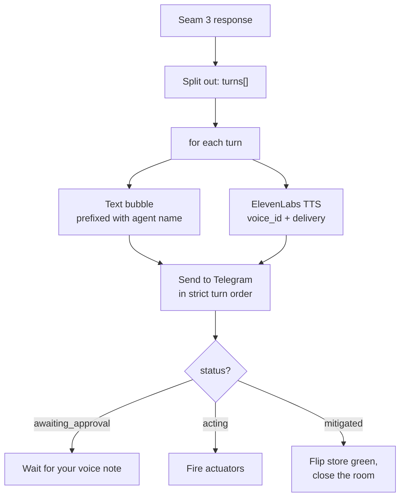

Voice notes are rendered in parallel for speed but **sent in turn order**, so the debate never arrives scrambled.

---

## 13. Actuators

When the room decides to act, n8n switches on `action.type` and fires the matching actuator. Adding a new action means adding one node — nothing else changes.

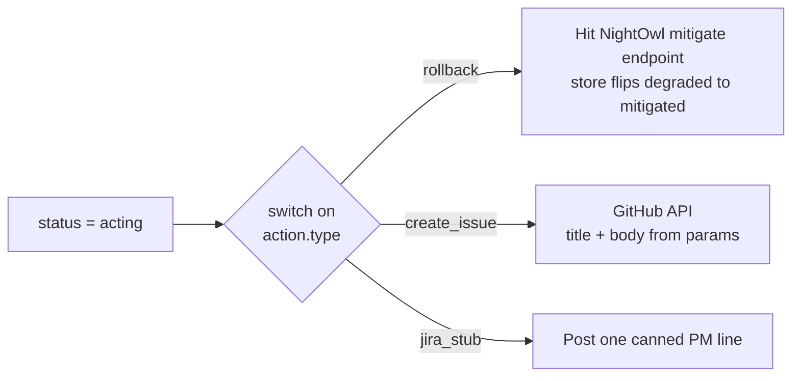

| Action | What it does |
|---|---|
| `rollback` | Hits NightOwl's mitigate endpoint so the store visibly goes degraded → mitigated on screen. |
| `create_issue` | Files a GitHub issue with the title and body from `params`. The seam where an automated fix can pick up. |
| `jira_stub` | Sends one canned PM line ("Ticket QUO-142 created, assigned to you") — proof that "add a domain = register a specialist" without building Jira. |

Actuators are designed to be idempotent: actions are emitted only on the transition into `acting`, so a stray follow-up message can never double-fire a rollback or open a duplicate issue.

---

## 14. Extensibility: the specialist registry

Quorum is a hierarchy: a router classifies and dispatches; it never does the work itself. Adding a domain — Jira, CI, deploys, security, anything — means registering a new specialist against a small interface.

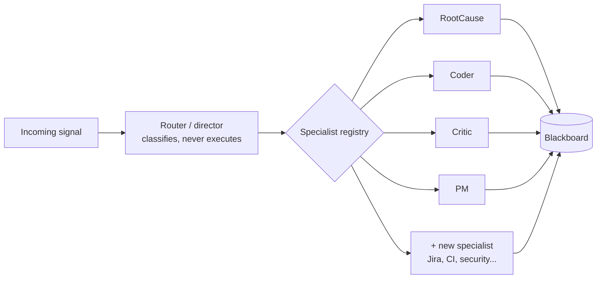

A specialist is a thin wrapper: load its system prompt, build a **scoped** slice of the blackboard (never the whole transcript), call the model, write the result back, return a turn. That single shape is the whole interface.

---

## 15. Multi-agent patterns

Quorum is a live demonstration of production multi-agent architecture. Each pattern is nameable as it happens on stage:

- **Hierarchical orchestration** — an Orchestrator routes to registered specialists; the router classifies, never executes.
- **Actor-Critic loop** — Coder drafts, Critic reviews, Coder revises on feedback. Capped iterations, always an exit.
- **Adversarial debate** — agents argue opposing positions; a confidence gate determines the verdict.
- **Event-driven ingestion** — agents fire on signals from your stack, no polling.
- **Blackboard coordination** — shared session state, no peer-to-peer wiring.
- **Fail-closed gating** — two independent gates (a numeric confidence threshold and your emotional state) both clear before anything irreversible ships.

> The topology is the reliability — demonstrated, not claimed.

---

## 16. Tech stack

| Layer | Technology |
|---|---|
| Agents | Python, OpenRouter (OpenAI-compatible API) |
| Brain | FastAPI, Pydantic |
| Orchestration | n8n cloud |
| Voice | ElevenLabs TTS |
| Emotion | Valence (read off inbound voice notes) |
| Speech-to-text | Whisper or ElevenLabs STT |
| Channel | Telegram (Bot API) |
| Trigger | NightOwl (a deliberately broken demo store) |

---

## 17. Repo layout

One repo, two halves, a shared contract. The trees are disjoint so the two tracks rarely touch the same files.

```
quorum/
├── contract/
│   └── seams.md                 # SHARED. The four seams. Edit jointly, never alone.
├── brain/                       # Specialist agents + conversation director
│   ├── app.py                   # FastAPI, the four seams
│   ├── mock_app.py              # contract stub — wire the channel before the real brain exists
│   ├── director.py              # turn policy / state machine
│   ├── agents.py                # agent wrappers + OpenRouter calls + model tiers
│   ├── models.py                # Pydantic blackboard schema
│   ├── prompts/                 # one system prompt per agent
│   │   ├── orchestrator.md
│   │   ├── rootcause.md
│   │   ├── coder.md
│   │   └── critic.md
│   ├── seed/
│   │   └── known_fix.py         # a known-good reference patch seeded into the Coder
│   └── requirements.txt
├── integration/                 # n8n workflow, Telegram, actuators
│   ├── n8n/
│   │   └── quorum.workflow.json
│   ├── nightowl/                # the broken demo store
│   └── adapters/
│       ├── valence_adapter.md
│       └── elevenlabs_voices.md
└── README.md
```

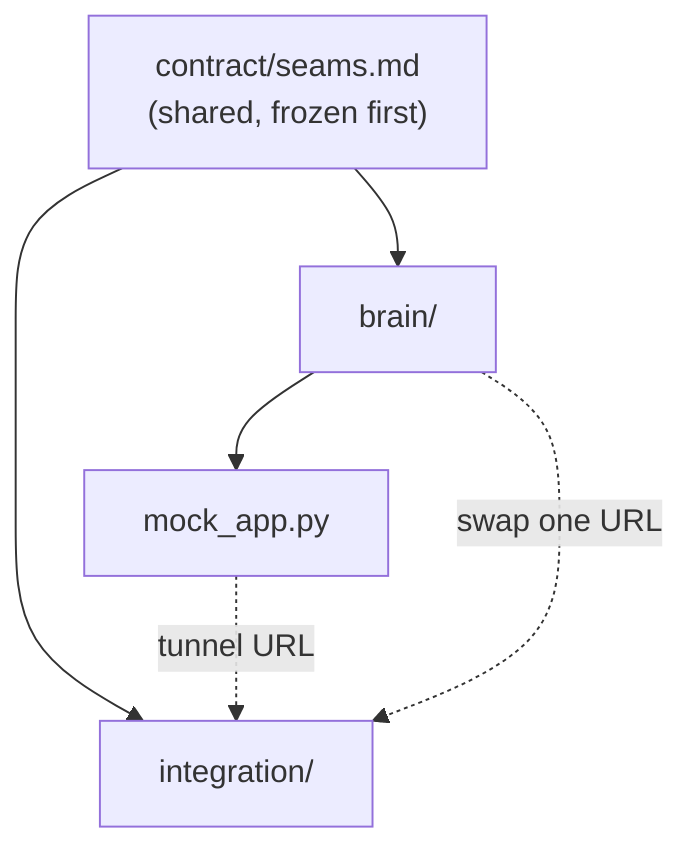

The one shared file is the contract. Freeze it together first; everything downstream decouples once the four shapes are locked.

---

## 18. Getting started

### Prerequisites

- Python 3.11+
- n8n cloud account
- Telegram bot token(s) + a group
- ElevenLabs API key (a plan with enough characters for repeated rehearsals)
- Valence API key
- OpenRouter API key

### Brain

```bash
git clone https://github.com/p-kowadkar/Quorum.git
cd Quorum/brain
pip install -r requirements.txt

# Copy and fill env
cp .env.example .env

# Run the real brain
uvicorn app:app --port 8000

# Or run the mock stub while building the channel (no OpenRouter needed)
uvicorn mock_app:app --port 8000
```

Expose it publicly so n8n cloud can reach it (n8n cloud cannot reach `localhost`):

```bash
cloudflared tunnel --url http://localhost:8000
# or: ngrok http 8000
```

> Prefer a **named/static tunnel** (or deploy the brain to a small public host) so the URL survives restarts and you never re-paste it into n8n mid-demo.

### Integration (n8n + Telegram)

1. Import `integration/n8n/quorum.workflow.json` into your n8n cloud instance.
2. Set the brain URL in the two HTTP nodes to your tunnel (or deployed) URL.
3. Add your Telegram bot token(s), ElevenLabs key, and Valence key as n8n credentials.
4. Point NightOwl's outbound webhook at the n8n webhook URL.
5. Activate the workflow.

### Trigger a demo run

```bash
cd integration/nightowl
npm install && npm run dev
```

Start the store and hit checkout. Watch the Telegram group light up. (Or POST a canned payload straight to the n8n webhook to skip the store.)

### Build order

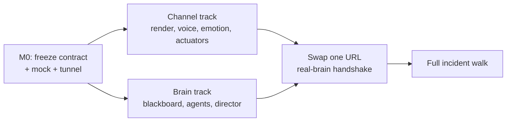

Both tracks run in parallel against the frozen contract; the mock brain keeps the channel track off the real brain's critical path until the single-URL swap.

---

## 19. The demo walk

Read this as the script — it is just the blackboard states, out loud.

1. You press checkout in **NightOwl**. It fails. The store shows **Checkout: degraded**.
2. n8n catches the structured error and opens a session. The **Telegram group lights up.**
3. **Orchestrator:** "Checkout's down, payment gateway timeout. RootCause, your read?" *(calm)*
4. **RootCause:** a hypothesis off the real stack frames. *(methodical)*
5. **Coder:** proposes the fix — seeded with a known-good reference patch, so it reads sharp. *(confident)*
6. **Critic** cuts in: "Hold on — empty-cart path." They go a round. Lands at **0.78**. *(concerned, easing)*
7. **Orchestrator** turns to you: "Cleared at 0.78. Approve the rollback?"
8. You reply by **voice note**, sounding unsure. **Emotion gate fires:** "You don't sound sure. Want me to hold?" — the moment that wins the room.
9. You confirm, steady this time. Status → **acting.** n8n fires rollback + GitHub issue + the Jira-stub line.
10. **NightOwl flips to mitigated** on screen. The room closes.

Name the patterns as they happen — Hierarchical, Adversarial Debate, Blackboard, the fail-closed gate.

---

## 20. Roadmap

| Status | Item |
|---|---|
| ✅ Anchor | Audible multi-agent debate with distinct per-agent voices |
| ✅ Anchor | Emotion-gated approval off your inbound voice notes |
| 🔜 Next | Lessons-learned retrieval at triage ("we've hit this before") |
| 🔜 Next | A live PM/Jira specialist beyond the stub |
| 🧪 Stretch | GitHub issue → automated fix PR, closing the loop |
| 🧪 Stretch | Additional specialists: CI, deploys, security |

---

## 21. License

Quorum is released under the **GNU GPL v3**. See [LICENSE](LICENSE).

---

*Built at the Rebuild × ElevenLabs Hackathon — NYTechWeek 2026.*
